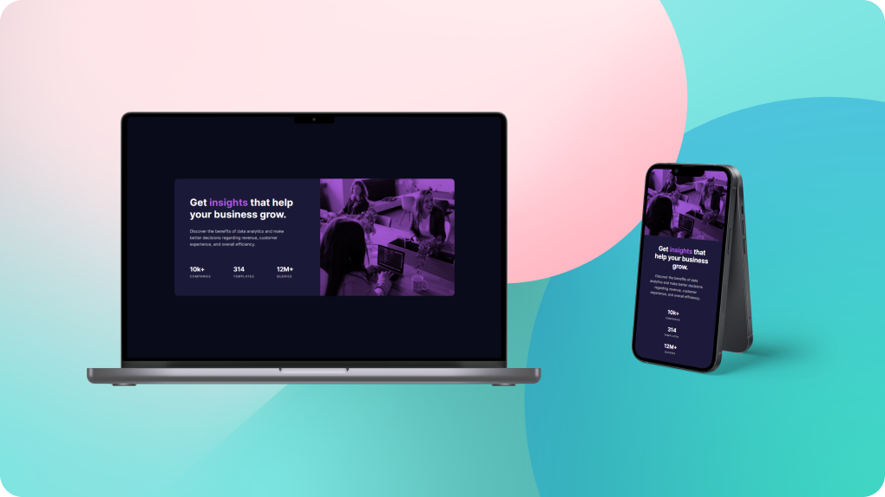

## Table of contents

- [Overview](#overview)
  - [The challenge](#the-challenge)
  - [Screenshot](#screenshot)
  - [Links](#links)
- [My process](#my-process)
  - [Built with](#built-with)
  - [What I learned](#what-i-learned)
  - [Continued development](#continued-development)
  - [Useful resources](#useful-resources)
- [Author](#author)
- [Acknowledgments](#acknowledgments)

## Overview

### The challenge

Users should be able to:

- View the optimal layout depending on their device's screen size

### Screenshot

### Links

- Solution URL: [Add solution URL here](https://your-solution-url.com)
- Live Site URL: [Add live site URL here](https://your-live-site-url.com)

## My process

### Built with

- Semantic HTML5 markup
- CSS custom properties
- [Flexbox](https://css-tricks.com/snippets/css/a-guide-to-flexbox/)
- [SASS](https://sass-lang.com/)

## Author

- Frontend Mentor - [@APdev88](https://www.frontendmentor.io/profile/APdev88)
- Twitter - [@ap\_\_dev](https://twitter.com/ap__dev)
- Linkedin - [My Linkedin](https://www.linkedin.com/in/apdev88/)
